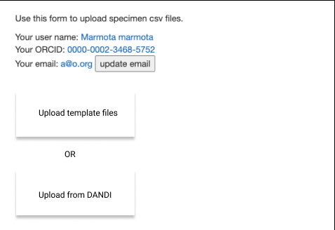
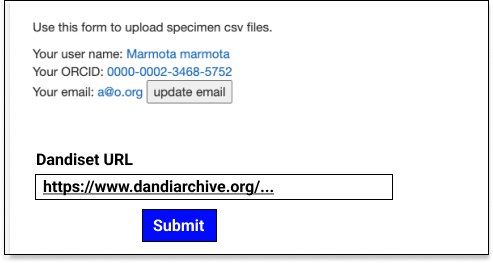
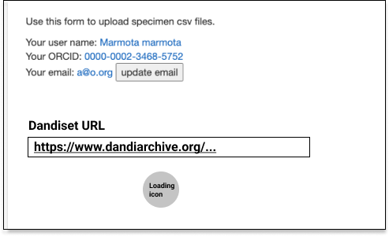
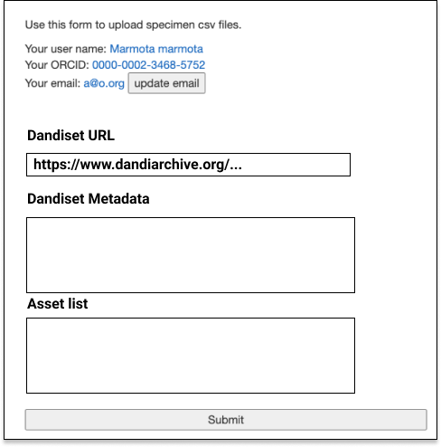

# DANDI API Integration

This document outlines a proposed strategy for integrating the
[DANDI API](https://www.dandiarchive.org/handbook/) with the ingest system for metadata ingest of datasets
stored on DANDI.

## Problem Statement

---

There is a large intersection between the metadata available on the DANDI
datasets and the specimen ingest template we use to load metadata into
the ingest system. The proposed solution leverages the DANDI API to 
fetch metadata of datasets (mapped largely to data_collections) and 
the underlying file assets (mapped largely to specimen entries/file manifests).
The purpose of this solution is to reduce duplication of efforts on the data 
submitters to submit similar if not the same metadata to both the archive and to
our ingest system.

The implementation needs to address the following problems:

- Connecting to and pulling data from DANDI API
- Mapping metadata from DANDI to specimen ingest model
- Integration with existing specimen ingest pipeline
    - Currently, we are ingesting CSV/XLSX files that get versioned and loaded
    into the triple store for indexing. The solution needs to address transforming
    metadata from DANDI into a common format for storage with the existing CSV/XLSs
    file storage.
- Integration with existing re-upload feature
    - To allow for edits to existing uploads, the system re-uploads the entire
    ingest file and tags the ingest with a new version. The underlying file is stored
    in a new directory derived from the new version number and the version number is
    updated in the DB.


## Requirements

---

- User should be able to specify Dandiset URL as entrypoint
- User should be able to see preview of dandiset information
- User should be able to see preview of asset list
- User should be able to confirm preview before submitting ingest
- Ingest should fetch asset metadata from DANDI and extract relevant metadata for the specimen ingest
- Ingest should generate and populate a template file with metadata and upload to S3
- Ingest should trigger the same ingest pipeline as previous CSV uploads (deduplication/CV check/triple store load etc.)
- Re-upload should generate a new template file, increment the version number, and upload to S3

## High-level design

--- 

### Direct API integration vs file download/upload
The DANDI API supports a direct integration to the RESTful API via a client OR
indirect integration via CLI file download/upload. 

Direct integration has several pros/cons where the pros outweight the cons:
- **[pro]** One entrypoint for end users to point to their metadata
- **[pro]** Easy incorporation of existing DANDI python client into codebase
- **[pro]** Avoid wrangling local files via scripts/notebooks
- **[pro]** Highly parallelizable architecture as each asset can be fetched
    and transformed independently
- **[con]** Maintenance might be required if API/client code changes
- **[con]** More difficult to debug as dev/testing needs to happen against AWS infra

This solution will serve as a **READ-ONLY** integration with the DANDI API.
Writing data back to DANDI, while possible with the tools being used, are out
of scope for this implementation.

## Detailed design
This solution will serve as a wrapper over the existing [DANDI API python client](https://dandi.readthedocs.io/en/latest/modref/index.html).
The solution will expose methods for fetching the following information:
- Dandiset (data collection) metadata
- Asset (specimen) metadata
- Asset list (all specimens for a collection)
The solution will integrate with the existing messaging infrastructure to trigger ingest

---
### DANDI client
- The client requires an API Key to function. 
    - Signing up for an account at the [DANDI archive UI](https://gui.dandiarchive.org/#/) with github will grant
    an API key for dev use
    - We'll need a non-developer account linked API Key for prod use
- Authentication can be done as follows:
```
from dandi.dandiapi import DandiAPIClient

key = # Fetch from app config
client = DandiAPIClient(token=key)
client.dandi_authenticate()
```

### DANDI objects
**Dandiset** - Dandisets correspond to our data collection objects.
- Dandisets have a unique identifier URI that can be used to fetch the metadata:
```
id = "https://dandiarchive.org/dandiset/000026/"
dandiset = client.get_dandiset(id)
```

**Assets** - Assets correspond to our specimen objects.
```
assets = dandiset.get_assets()
metadata = {}
for asset in assets:
    metadata[asset.identifier] = asset.get_raw_metadata()
```

### DANDI schema
The [schema definitions](https://github.com/dandi/schema/tree/master/releases) for DANDI closely correspond to
our ingest schema. These schema are generated from dandi's [api objects](https://github.com/dandi/dandischema)
using [Pydantic](https://github.com/samuelcolvin/pydantic). The solution will implement a `SchemaTransformer` 
interface to allow for mapping between the dandiset schema and the ingest schema.
- The `SchemaTransformer` should take in an input schema, a `mapping` object, and an output schema
- See [mappings](https://github.com/BICCN/BCDC-Metadata/pull/32) for current schema
- The transformer should transform the data from each dandiset/asset to the output schema, raising exceptions
    for any unpopulated required fields

### Models
The solution will insert/update into the following tables:
- `IngestUpload` - record indicating an ingest upload was created
- `BatchUpload` - record pointing to versioned template file(s) generated by transformer
- `WellKnownFiles` - record containing metadata for template file generated by transformer

### Views
The solution will update the upload view to diverge based on method of upload
- Allow user to choose between uploading CSVs or using a DANDI uri



- Upload method selection form should redirect to new form container with
    pluggable forms for the selected upload method. Ex: If user selects 
    DANDI upload, redirect to `UploadFormContainerView` with `DandiUploadForm`.
    If user selects csv upload, redirect to `UploadFormContainerView` with `CSVUploadForm`.
- Each pluggable form will implement their own form validation, and follow up actions
    to generate/validate an upload template. The workflows will converge after upload to S3, 
    at the entrypoint of the ingest state machine.
- Allow user to choose the dandiset they want to upload




- Allow user to preview information (dandiset metadata/asset list) from DANDI



### Provenance
The solution will track changes to DANDI metadata by versioning the underlying
template files generated by the API client
- Users will need to submit a reupload of an ingest
- Users will be able to review the dandiset and the asset list again at the 
    time of resubmit 


## Future Development/Features

---
- Validating metadata coming from DANDI before ingest
    - BCDC NWB extension
- Add scheduled/ad-hoc reingest of uploads specifically from DANDI
- Write objects back to DANDI API
    - We can leverage Pydantic to marshal dandi api objects created/updated on our side.


